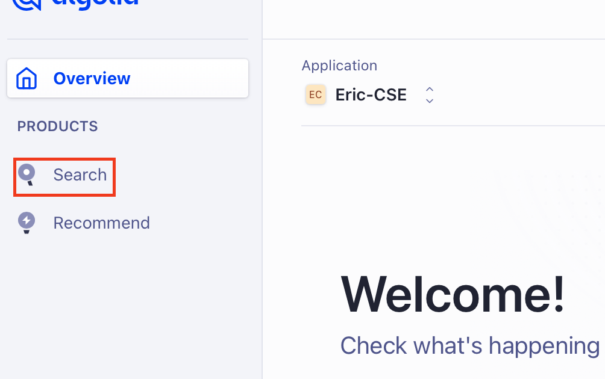
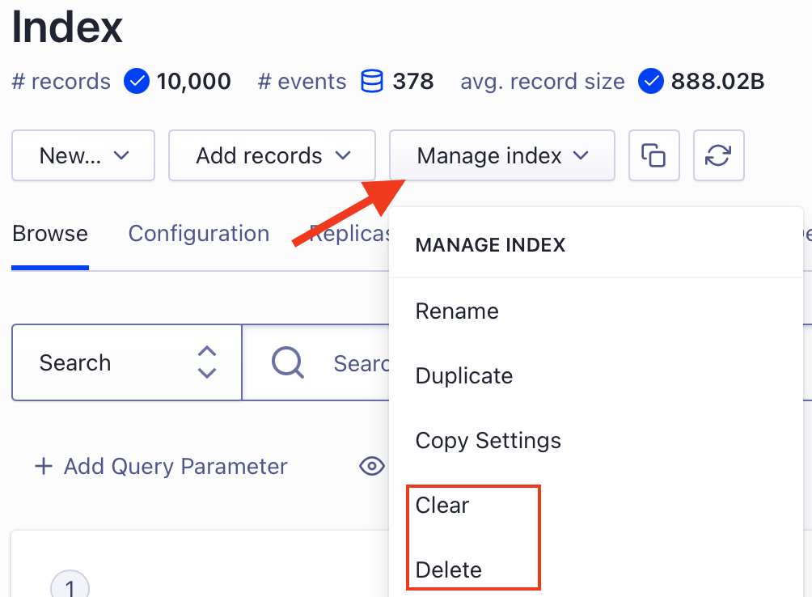

from: Eric
Subject: RE: Bad design

Hi Mariss,

No apology necessary - we value customer feedback very highly so thank you so thank you for reaching out on this.

Sorry to hear you don't like the new dashboard design! Can you describe where you're needing to click in order to clear or delete an index?

From the overview screen, you can click the search icon on the right:

and then you'll have the ability to manage the index in one more click:

Ideally for your process, where in the UI would you want to see these functions? I think your experience would be valuable information for Product.

Please let me know if this helps, and if there is other feedback I can convey to the team.

Best,

Eric
